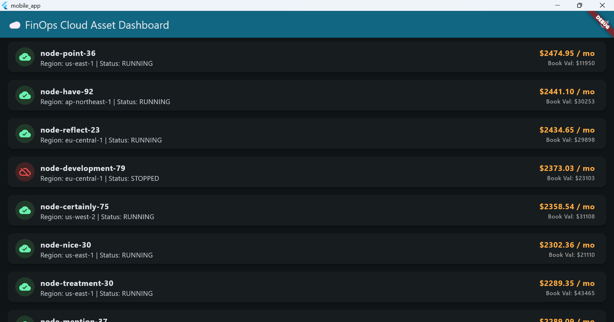
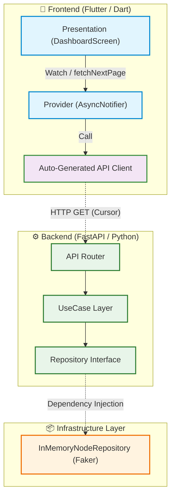

# ☁️ FinOps Cloud Asset Tracker (Mobile Dashboard)

[](https://github.com/y-matsuo081991/finops-asset-tracker-mobile/actions/workflows/ci.yml)
[](https://flutter.dev/)
[](https://fastapi.tiangolo.com/)
[]()
[]()
[]()

> **"会社の無駄なサーバー代を見つけて節約するための、IT部門向けモバイルダッシュボード"**

<!-- UIスクリーンショットのプレースホルダー -->
<div align="center">
  
</div>

## 📖 概要 (Overview)
本プロジェクトは、企業のIT部門やCTO向けに、**クラウドインフラの稼働状況とコスト（サーバー代）、およびソフトウェアの帳簿価格（簿価）をモバイルからリアルタイムで監視・最適化する「FinOpsダッシュボード」**の概念実証（PoC）ポートフォリオです。

### 💡 なぜこのプロジェクトを作ったのか (The "Why")
**課題:**
クラウドの普及により、世界中のエンタープライズ企業で「不要なサーバーの消し忘れ」によるコストの肥大化（Cloud Waste）が経営課題となっています。
**解決策:**
本プロジェクトでは、モバイルからインフラのコストと簿価のバランスを可視化するダッシュボードを構築し、FinOps（Finance × DevOps）の推進をサポートするアーキテクチャを実証しています。

---

## ✨ 主な機能とアーキテクチャのハイライト (Key Features & Architecture)

本プロジェクトは「世界標準のフルスタック・アーキテクチャ」を実証するため、以下のモダンな設計パターンを取り入れています。

### 1. Clean Architecture (ドメイン駆動設計)
フロントエンド・バックエンド共にレイヤードアーキテクチャを採用しています。
*   **Backend:** APIルーター層、ビジネスロジックをカプセル化した `UseCase` 層、そして Faker による合成データを隠蔽する `Repository` 層へと完全に責務を分離しています。
*   **Frontend:** `main.dart` へのモノリシックな依存を排除し、`domain`, `data`, `presentation`, `providers` ディレクトリへ適切に分割されています。

### 2. Schema-Driven Development (APIの自動生成)
バックエンド（FastAPI）から出力された `openapi.json` を SSOT (Single Source of Truth) とし、`openapi-generator-cli` (Java 17環境) を用いて Flutter 側の Dart クライアントコードおよび型安全なモデル群 (`lib/api_client`) を自動生成しています。手動パースによるバグ（API Drift）を防ぎます。

### 3. Cursor-Based Pagination による無限スクロール
大量のクラウド資産データを扱うため、従来の Offset-based からモダンな **Cursor-Based Pagination** へとAPIを拡張しています。Flutter 側では、Riverpod 2.x の王道パターンである `AutoDisposeAsyncNotifier` と `AsyncValue.guard`, `copyWithPrevious` を用いて、スクロール位置を保持したまま滑らかな無限スクロールを実現しています。

### 4. DevOps と メモリ最適化 Docker 環境
CI/CDパイプライン（GitHub Actions）により、Linter / Pytest / Flutter Test / Docker Build がプッシュ毎に自動検証されます。バックエンドのコンテナは `python:3.11-slim` と Multi-stage Build、および `gunicorn --preload` オプションを採用し、Cloud Run 等の制限された無料枠でも安定稼働する「メモリフットプリント極小化」を達成しています（ADR 005参照）。



## 🛡️ コンプライアンスとデータに関する注意 (NDA Compliance)
本リポジトリは、筆者のアーキテクチャ設計能力を証明するための公開ポートフォリオです。
**機密保持（NDA）を厳格に遵守するため、実在の企業データや社内システム情報は一切含まれていません。**
表示されるすべてのサーバー名、ステータス、コストデータは、バックエンドの Infra 層において `Faker` ライブラリを用いて動的に生成された**架空の合成データ（Synthetic Data）**です。

---

## 🚀 今後のロードマップ (Phase 3)
- [ ] **Data Visualization:** `fl_chart` を用いたコスト推移のグラフ（円グラフ・バーチャート）追加。
- [ ] **CI/CD & Cloud Run:** GitHub Actions を用いたバックエンドの自動デプロイと Live Demo の公開。

## 💻 ローカルでの動かし方 (How to run locally)

### 1. Backend (FastAPI) の起動

**方法A: Dockerを使用する場合 (推奨)**
```bash
docker compose up --build -d
```
APIは `http://localhost:8000` で起動します。

**方法B: ローカルのPython環境を使用する場合**
```bash
cd backend
python -m venv venv
# Windows: .\venv\Scripts\activate
# Mac/Linux: source venv/bin/activate
pip install -r requirements.txt
uvicorn app.main:app --reload
```

### 2. Frontend (Flutter) の起動
別のターミナルを開き、以下のコマンドを実行します。
```bash
cd mobile_app
flutter pub get
flutter run -d windows  # Windowsデスクトップアプリとして起動する場合
```

※もし `flutter` コマンドが見つからない（PATHが通っていない）場合は、Flutter SDK のフルパスを指定して実行してください。
```bash
# 例 (Windows環境):
C:\path\to\your\flutter\bin\flutter.bat run -d chrome
```
