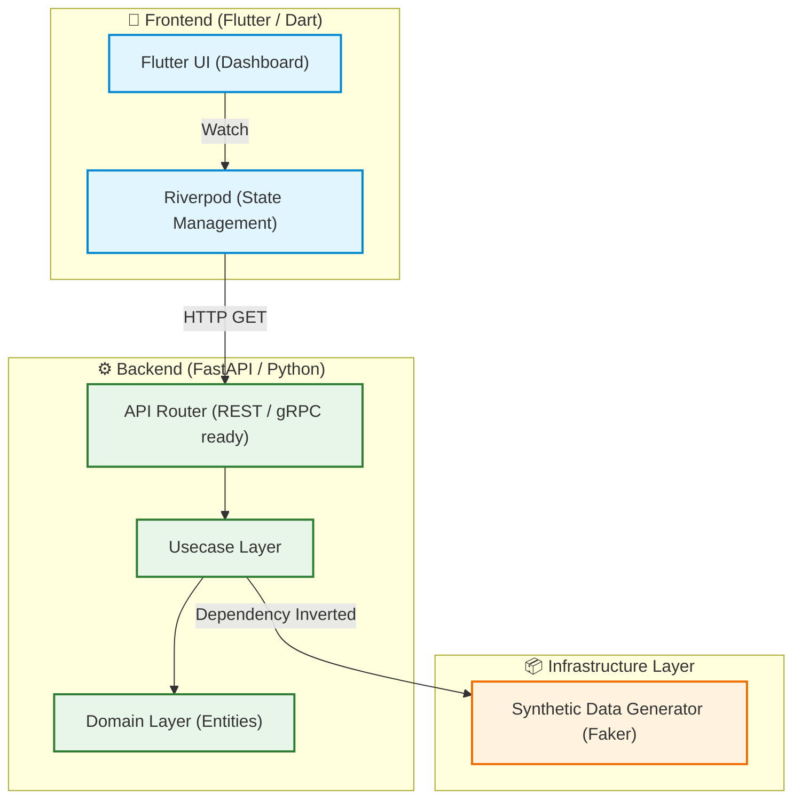

# ☁️ FinOps Cloud Asset Tracker (Mobile Dashboard)

[](https://flutter.dev/)
[](https://fastapi.tiangolo.com/)
[]()
[]()

> **"会社の無駄なサーバー代を見つけて節約するための、IT部門向けモバイルダッシュボード"**

<!-- UIスクリーンショットのプレースホルダー -->
<div align="center">
  
</div>

## 📖 概要 (Overview)
本プロジェクトは、企業のIT部門やCTO向けに、**クラウドインフラの稼働状況とコスト（サーバー代）、およびソフトウェアの帳簿価格（簿価）をモバイルからリアルタイムで監視・最適化する「FinOpsダッシュボード」**の概念実証（PoC）ポートフォリオです。

### 💡 なぜこのプロジェクトを作ったのか (The "Why")
**課題:**
クラウドの普及により、世界中のエンタープライズ企業で「不要なサーバーの消し忘れ」によるコストの肥大化（Cloud Waste）が経営課題となっています。
**解決策:**
本プロジェクトでは、モバイルからインフラのコストと簿価のバランスを可視化するダッシュボードを構築し、FinOps（Finance × DevOps）の推進をサポートするアーキテクチャを実証しています。

---

## 🏗️ システムアーキテクチャ (System Architecture)
フロントエンドは `Flutter` と `Riverpod` によるリアクティブな状態管理を採用し、バックエンドは `FastAPI` による **Clean Architecture (ドメイン駆動設計)** に基づいて構築されています。



## 🛡️ コンプライアンスとデータに関する注意 (NDA Compliance)
本リポジトリは、筆者のアーキテクチャ設計能力を証明するための公開ポートフォリオです。
**機密保持（NDA）を厳格に遵守するため、実在の企業データや社内システム情報は一切含まれていません。**
表示されるすべてのサーバー名、ステータス、コストデータは、バックエンドの Infra 層において `Faker` ライブラリを用いて動的に生成された**架空の合成データ（Synthetic Data）**です。

---

## 🚀 今後のロードマップ (Phase 2)
- [ ] **Cursor-Based Pagination:** 大量データを滑らかに読み込む無限スクロールの実装（モバイル開発のグローバル標準）。
- [ ] **Data Visualization:** `fl_chart` を用いたコスト推移のグラフ（円グラフ・バーチャート）追加。
- [ ] **CI/CD & Cloud Run:** GitHub Actions を用いたバックエンドの自動デプロイと Live Demo の公開。

## 💻 ローカルでの動かし方 (How to run locally)

### 1. Backend (FastAPI) の起動
```bash
cd backend
python -m venv venv
# Windows: .\venv\Scripts\activate
# Mac/Linux: source venv/bin/activate
pip install -r requirements.txt
uvicorn app.main:app --reload
```
APIは `http://127.0.0.1:8000` で起動します。

### 2. Frontend (Flutter) の起動
別のターミナルを開き、以下のコマンドを実行します。
```bash
cd mobile_app
flutter run -d windows  # Windowsデスクトップアプリとして起動する場合
```
